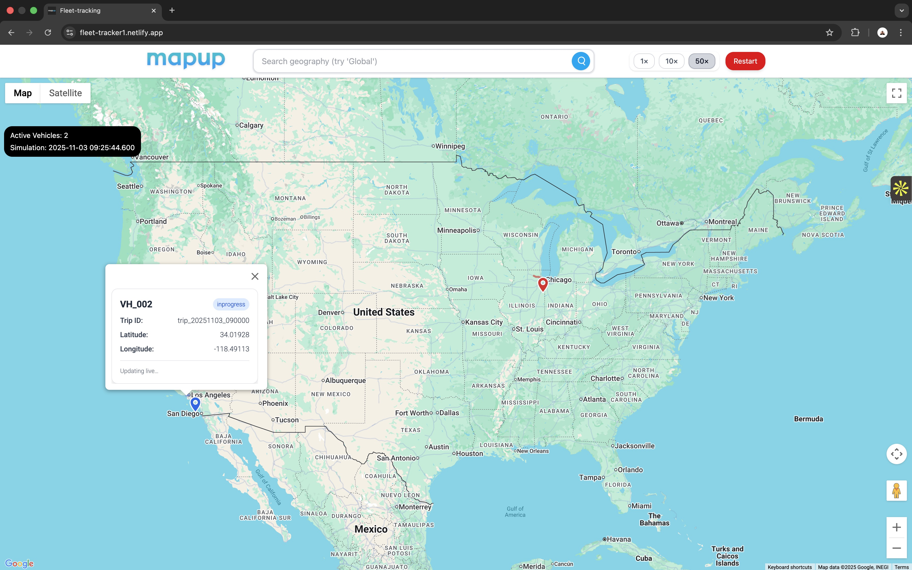
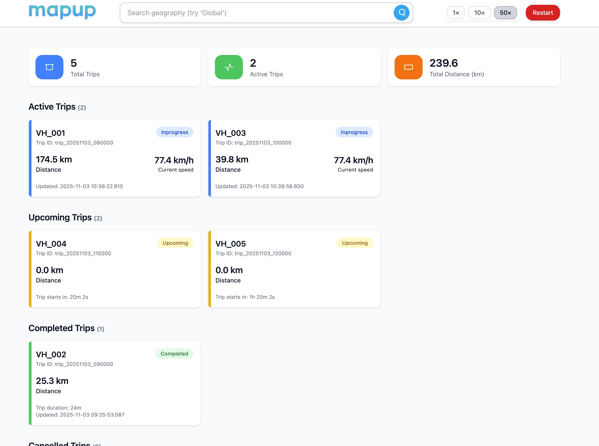
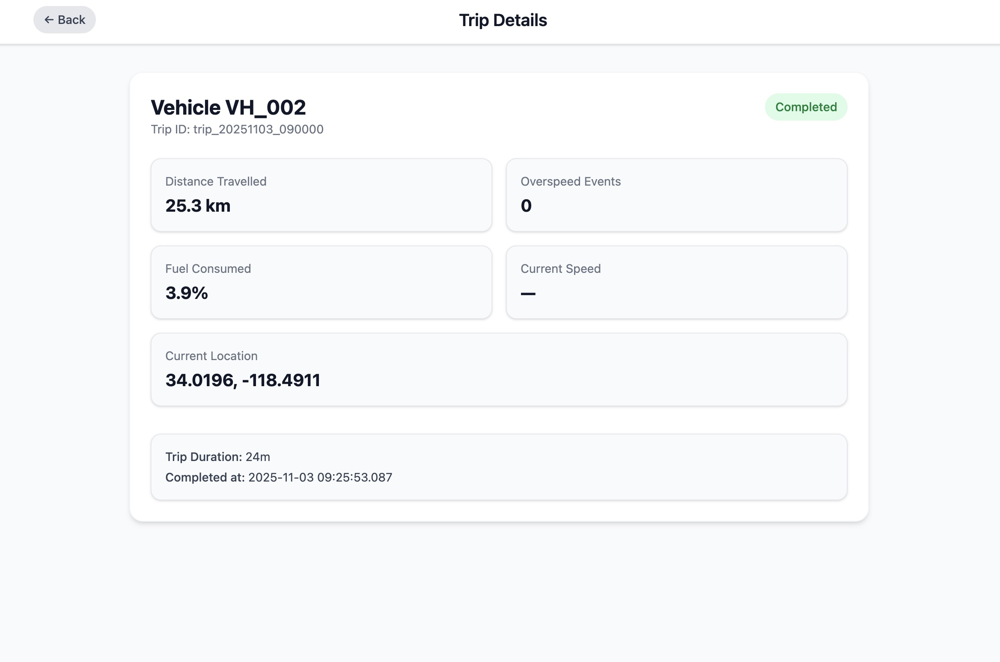
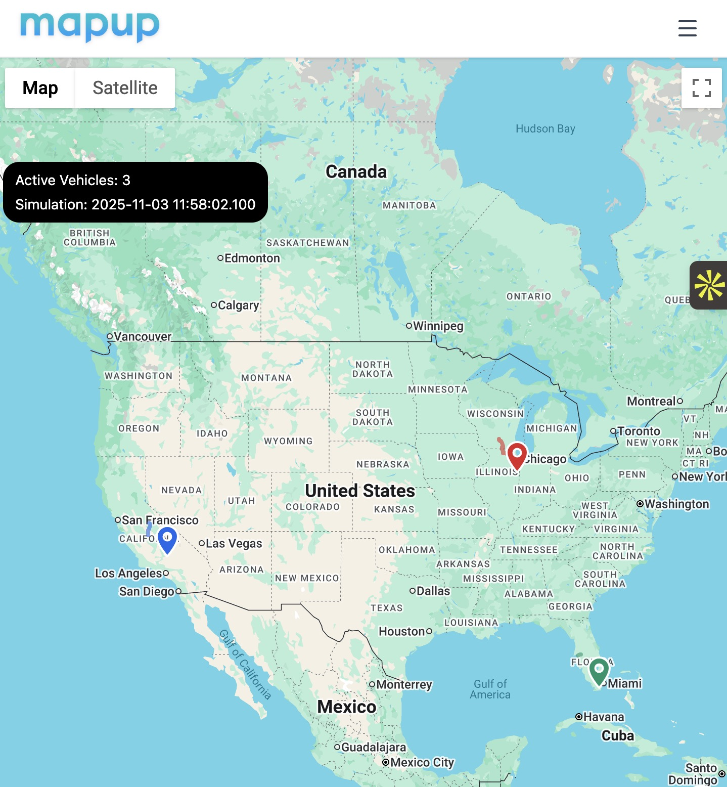

# Fleet Tracker

A real-time fleet tracking dashboard built using realistic vehicle trip data.
Visualizes live trips, vehicle movement, and operational insights across geographies using Google Maps.

The objective is to build an interactive system that simulates real fleet behavior, enhances trip visibility, and delivers actionable analytics.

---

Live URL: https://fleet-tracker1.netlify.app/

## **Project Preview**  

  
  
  

  
  

---

## **Tech Stack**

React + Vite
Tailwind CSS
Google Maps JavaScript API
Context API
Lucide Icons
Netlify

---

## **Key Features**

**Global Fleet Map**: Visualize all active vehicles worldwide with custom markers and dynamic polylines.

**Real-Time Vehicle Simulation**: Live updates of vehicle movement, paths, and marker positions—auto-refreshing info windows included.

**Dashboard Metrics**: 
  - Fleet-level metrics: active vehicles, events, statuses
  - Trip-level metrics: trip progress, movement stats, anomalies
    
**Trip Cards**: Each trip shows status, current position, speed, and movement insights.

**Simulation Controls**: Toggle simulation speed (1x, 10x, 50x), restart simulation.

**Responsive UI**: Fully adaptive layout for desktop, tablet, and mobile—optimized with a clean topbar + hamburger navigation.

---

# Future Scope

- **Fleet Categorization**: Filtering by vehicle type, trip type, region, and fuel type.
  
- **Real-Time Notifications**: Alerts for trip start, completion, cancellation, or anomalies.
  
- **Safety & Incident Alerts**: Warnings for GPS signal loss, device failure, or potential accidents.

- **Driver Fatigue Monitoring**: Driving hour limits and rest-period compliance.
  
- **Trip Scoring & Predictive Insights**: Scores based on overspeeding, idling, harsh braking, and fuel efficiency.
